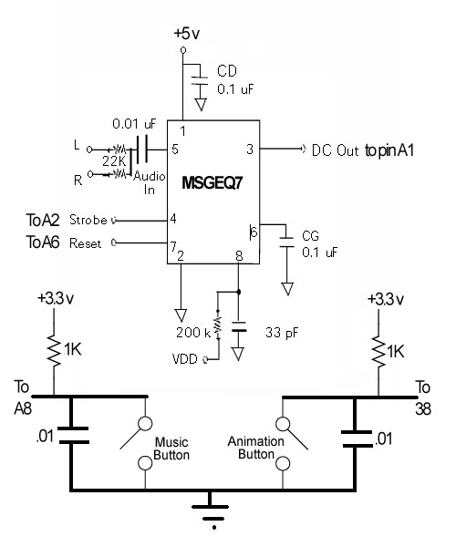
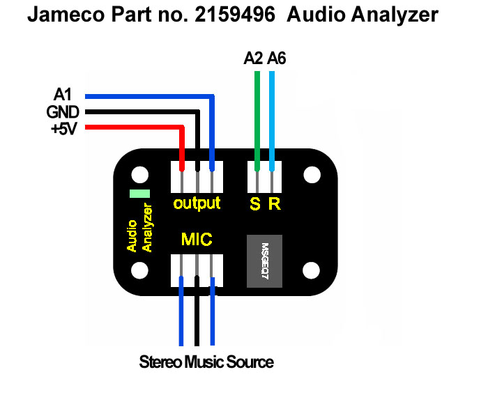

VERSION 4

This version incorporates all the features of Versions 1, 2, and 3, plus it adds the ability to use music to control your cube. It requires some additional circuitry, both to analyize the incoming sound and to switch between the different modes of operation. It includes a number of special effects that make your cube respond to the incoming music source. Both the hardware the sofware to support music come from SuperTech-IT.

INSTRUCTIONS FOR VERSION 4

Version 4 is all the work of SuperTech-IT. It adds both hardware and software to allow your cube to be driven by music. And it has a number of different visual effects as to how the music interacts with the cube. Still present are all the animations and text capabilities that are in Version 3, plus the addition of one new animation - a fireworks display.

If you want to add music, use this version. It contains support for the music hardware and the addition of switches to switch between animation and music modes and between the various music effects. If you have no plans for music, Version 3 is recommended, as it is somewhat easier to use and understand.

Here is a video from SuperTech-IT on how it all works: youtube.com/watch?v=xTHdJ9oVfT8

At the heart of the hardware additions is the MSGEQ7, a 7 channel graphic analyzer IC. The additional circuitry required is shown below. You can wire it up yourself as shown here. The pin references are to Chipkit UNO32 pins.

An alternative to wiring the whole thing up yourself is a small circuit board that I found at Jameco. It's shown below and contains all the parts associated with the MSGEQ7. Of course, you'll still need the switches in addition to the audio analyzer. If you go with this option, please ignore the color of the wires on the cable that comes with it. Mine came with a red wire for ground and a black wire for +5v! Go by the position of the terminals on the board.

Between SuperTech-IT's video and what I've said here, you should have enough information to get a system up and running. The software support for music is sprinkled around in various places including the refresh timer interrupt. But the 11 actual music effects themselves are all contained in the Music tab. For a lot more information about how all the software in this version works and is organized, please see the instructions for Version 3.