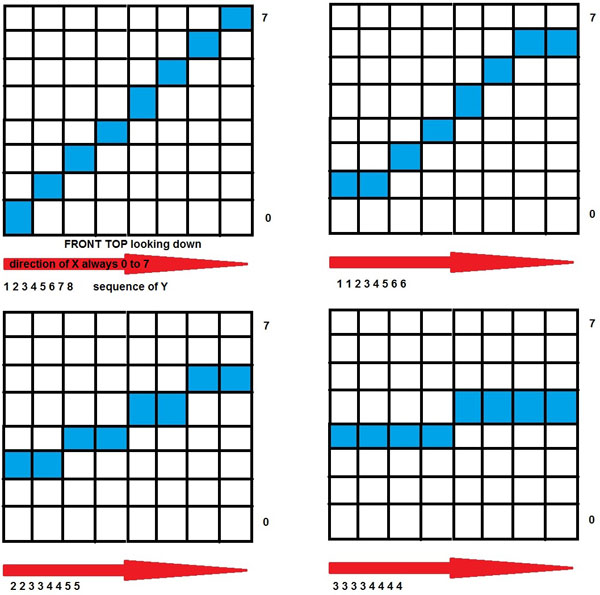

VERSION 5

This version of the software is all about rotating stuff in the cube. This version does not contain all the software and animations from previous versions. It does, however, contain all the subroutines from previous versions, including the ones that support music. It also has two new animations - one called Cosine and a new fireworks animation - fireWorks.

In this version, we look at various ways to rotate stuff, and we introduce the tools to rotate the entire content of the cube by any amount and at any speed. I've also included demos of everything in the main loop, including two examples of making a moving animation revolve while its running.

INSTRUCTIONS FOR VERSION 5

Version 5 is all about rotating stuff in the cube.

But before getting into all that, we need to discuss the organizaion of all these various versions of the software. Up until now, every version has simply added to the features of the previous version. However, Versions 3 and 4 have gotten quite large, and version 4 contains special software throughout the various animations to support the buttons added to control the music effects. So Version 5 is a departure from having each version contain everything from the previous one. In version 5, we still have all the subroutines that were available to you in Version 4 (including support for music), but we have removed all the animations, and don't have any music support in the main loop. Instead, we have focused Version 5 at rotating stuff in the cube, and the animations in Version 5 are all examples of using these rotation schemes.

To begin talking about rotation, we start with the rotating text we introduced in Version 3. It is also the first animation in our demo software in this version. With this scheme, we simply rotate characters in 45 degree increments, 8 transitions in all for a full revolution. Because the diagonal of the cube is 1.414 (sq. root of 2) times the side of the cube, we squeeze down the characters by dividing their distance from center by sq. root of 2. This causes some distortion, but keeps the character width approximately constant during rotation. We also attempt the center each character in the cube, which doesn't happen automatically since our font characters are typically 6 or 7 bits wide. This appoach works reasonably well for displaying characters, but only works with characters and only works with a single rotating plane.

Another scheme to rotate characters or anything else in a single plane is our next subject. SuperTech-IT introduced me to it, though it has made the rounds in various cube software. It is also the second animation (a revolving arrow) in our demo software in this version. It has the advantages of being very fast and very smooth, but does not fix the fact that the diagonals are wider than the sides of the cube.

The diagram above shows how it revolves through 45 degrees. You start on the diagonal and rotate 45 degrees to a flat surface on the cube. You can then work it in reverse to complete the next 45 degrees putting you back on the diagonal. Do all this three more times and you have a full rotation. The steps from diagonal to cube face are implimented through a short table, which in my implimentation is just called "table". See the code for more info on how it works.

But what about rotating the full content of the cube. That is really the main subject of this version, and what the rest of the demos in this version show us. The code required to rotate the whole cube contains some complicated math, but it is very concise. We basically convert the location of each LED in one layer to polar coordinates, rotate the coordinates by a specific angle, then convert them back to Cartisian coordinates (X and Y), and then find the LED that is nearest to those new XY coordinates. This has to be done for every LED in a layer, and then for each layer.

In order to make it happen fast enough, we resort to lookup tables to accomplish the math. The tables are stored at the bottom of our Font_Table tab. One table gives us the angle in radians to each LED from the center of the cube for one layer. The next table gives us the distance of each LED from the center of the cube, again for one layer. The last table gives us the sine and cosine for each 0.05 radians from 0 to 2 pi. (To find the sin or cos you need, the row you need in this table is int(myAngle*20 +.5) with sin in the first column and cos in the second.)

Even with the lookup tables, I don't know if this would be fast enough on an Arduino, but it works well with the ChipKit UNO32's 80 MHz processor!

But there is still one more complication to discuss. While we are rotating stuff around in the cube (which actually means in the cube array), we need to have a buffer area where we can store the stuff being rotated. So we create a second array called buffer_cube and that is where we store what is to be rotated. The nice thing about this approach is that we can put anything we want in the buffer_cube, including a whole animation. Then the whole moving animation can be rotated, as we demo with our cosine and fireworks animations.

The primary routine that contains the guts of the rotation process is called rotateLayer. It rotates one layer in the buffer_cube by the specified angle (in radians) and transfers it to the cube. It rotates the entire layer using polar coordinates.

A higher lever routine called rotateAll is used to rotate all layers by the specified angle (in radians) and transfers everything to the cube.

The highest level routine rotates the content in the buffer_cube though a specified number of full rotations in steps of a specified angle in degrees (NOT radians). The higher the step angle, the faster it will rotate.

These subroutines are all contained on the subroutine tab. The only thing required to use them is to put whatever you want to rotate into the buffer_cube array.

If you are going to have an animation running in buffer_cube, then you need to combine the running of your animation with the rotate_All routine to keep both the animation running and the rotation going. See the Rotating Cosine Animation for an example.

For additional information about what all is contained in Version 5 and how it's organized, please look at the code itself. It is well documented. Also please see instructions for Version 3, where we have additional information about all the subroutines from previous versions.